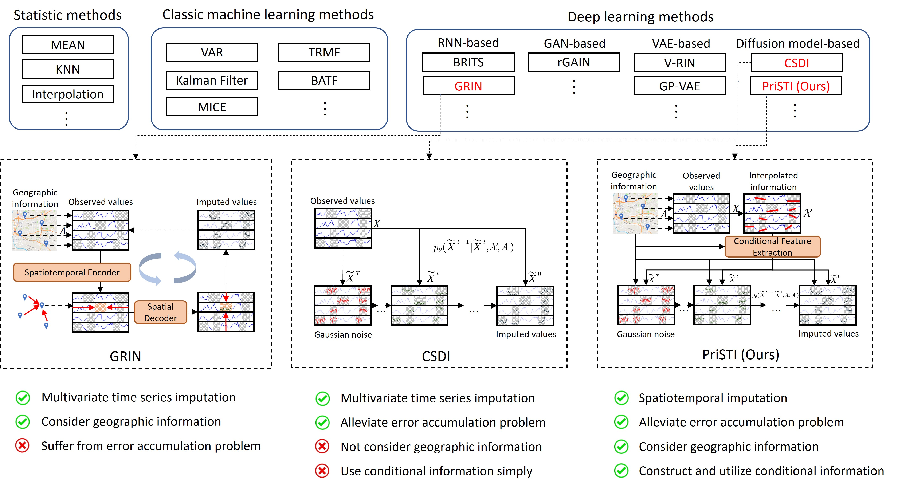
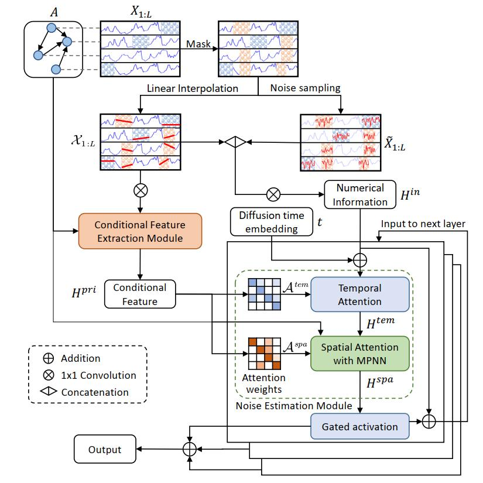

# PriSTI: A Conditional Diffusion Framework for Spatiotemporal Imputation

This is an official implementation of PriSTI (ICDE 2023). We provided the codes about the experiments on air quality dataset AQI-36 and traffic speed datasets METR-LA and PEMS-BAY.



We propose a conditional diffusion framework for spatiotemporal imputation with enhanced prior modeling. PriSTI constructs and utilizes conditional information with spatiotemporal global correlations and geographic relationships. 

## Framework

PriSTI takes observed spatiotemporal data and geographic information as input. 
The incomplete observed data is first interpolated to obtain the enhanced conditional information for diffusion model. 
- For the construction of conditional information, a conditional feature extraction module is provided
to extract the feature with spatiotemporal dependencies from the interpolated information. 
- For the utilization of conditional information, a noise estimation module is designed to mitigate the impact of the added
noise on the spatiotemporal dependencies learning. The noise estimation module utilizes the extracted conditional feature,
as the global context prior, to calculate the spatiotemporal attention weights, and predict the added Gaussian noise by
spatiotemporal dependencies. 




## Dataset

All the datasets can be used in the experiments. The dataset of AQI-36 is from Yi et al.[1], which has already stored in `./data/pm25/`. 
The datasets of METR-LA and PEMS-BAY are from Li et al.[2], which can be downloaded from this [link](https://mega.nz/folder/Ei4SBRYD#ZjOinn0CzFPkiE_V9yVhJw).
The downloaded datasets are suggested to be stored in the `./data/`.

[1] X. Yi, Y. Zheng, J. Zhang, and T. Li, “St-mvl: filling missing values in geo-sensory time series data,” in Proceedings of the 25th International Joint Conference on Artificial Intelligence, 2016

[2] Y. Li, R. Yu, C. Shahabi, and Y. Liu, “Diffusion convolutional recurrent neural network: Data-driven traffic forecasting,” in International Conference on Learning Representations, 2018

## Requirement

See `requirements.txt` for the list of packages.

## Experiments

### Training of PriSTI

To train PriSTI on different datasets, you can run the scripts `exe_{dataset_name}.py` such as:
```
python exe_aqi36.py --device 'cuda:0' --num_workers 16
python exe_metrla.py --device 'cuda:0' --num_workers 16
python exe_pemsbay.py --device 'cuda:0' --num_workers 16
```

### Inference by the trained PriSTI

You can directly use our provided trained model for imputation:
```
python exe_aqi36.py --device 'cuda:0' --num_workers 16 --modelfolder 'aqi36'
python exe_metrla.py --device 'cuda:0' --num_workers 16 --modelfolder 'metr_la'
python exe_pemsbay.py --device 'cuda:0' --num_workers 16 --modelfolder 'pems_bay'
```

## Citation

```bibtex
@article{liu2023pristi,
  title={PriSTI: A Conditional Diffusion Framework for Spatiotemporal Imputation},
  author={Liu, Mingzhe and Huang, Han and Feng, Hao and Sun, Leilei and Du, Bowen and Fu, Yanjie},
  journal={arXiv preprint arXiv:2302.09746},
  year={2023}
}
```


